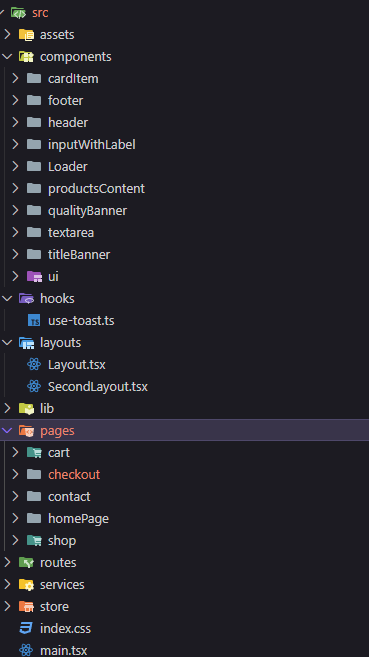

# TI-REX: Desafio-03 Compass UOL Challenge

## Furniro - A Complete Furniture Store

### Tecnologias Usadas:

**HTML**, **CSS**, **TypeScript**, **React**, **Tailwind CSS**, e outras bibliotecas necessárias para garantir a fidelidade ao design e funcionalidades do sistema

## 🚀 Tecnologias Utilizadas

<div align="left">
</div>
<div align="left">
  
  
  
    
  
  
  
  
  
  
  
     
</div>

## 📁 Estrutura do Projeto

 

## 📝 Como Executar o Projeto

Siga os passos abaixo para executar o projeto localmente:

## Como Executar o Projeto

1. Clone este repositório:

```bash
git clone [URL_DESSE_REPOSITORIO]
```

2. Navegue até a pasta do projeto:

```bash
cd SRC
```

3. Instale as dependências:

```bash
npm install
```

4. Execute o projeto:

```bash
npm run dev
```

5. Acesse o projeto no navegador:

```
http://localhost:5173
```
